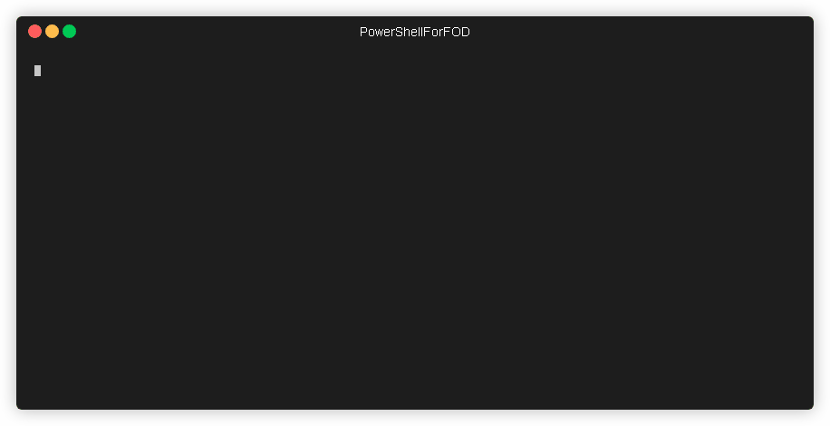
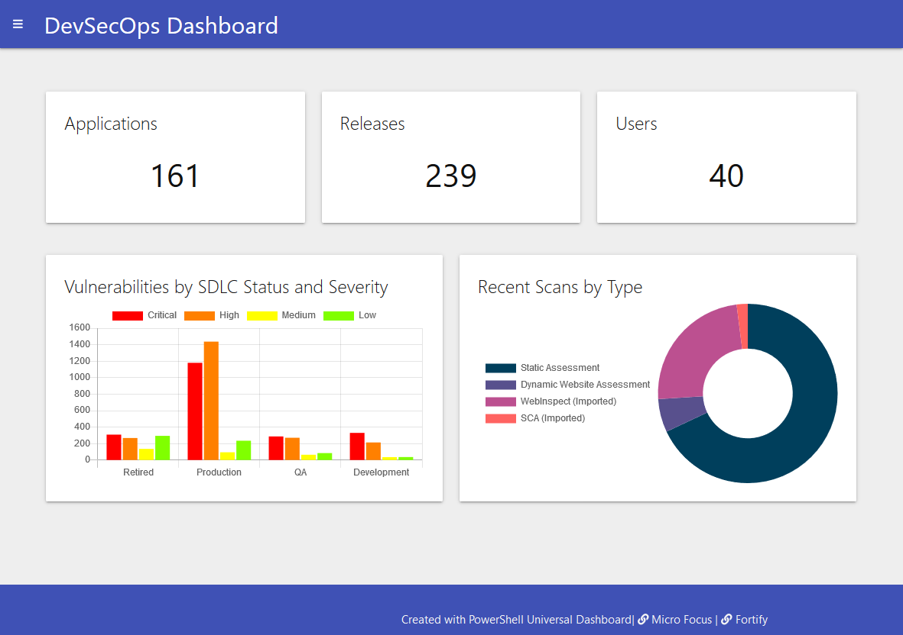

[](https://ci.appveyor.com/project/akevinlee/powershellforfod)

# Power Shell For Fortify On Demand (FOD) Module

#### Table of Contents

*   [Overview](#overview)
*   [Current API Support](#current-api-support)
*   [Installation](#installation)
*   [Configuration](#configuration)
*   [Usage](#usage)
*   [Logging](#logging)
*   [Developing and Contributing](#developing-and-contributing)
*   [Licensing](#licensing)

## Overview

This is a [PowerShell](https://microsoft.com/powershell) [module](https://technet.microsoft.com/en-us/library/dd901839.aspx)
that provides command-line interaction and automation for the [Fortify On Demand API](https://api.ams.fortify.com/swagger/ui/index).

 

## Use Cases

Although the module can be used generically, some use cases where it can be applied include:

 * Programatically importing existing users, applications and releases into FOD. Using PowerShell scripting it is possible 
   to create scripts that pull data from other sources - such as a spreadsheet - and execute the functions in this module.
 * Programatically importing on-premise scans executed using [Fortify SCA](https://www.microfocus.com/en-us/products/static-code-analysis-sast)
   or [Fortify WebInspect](https://www.microfocus.com/en-us/products/webinspect-dynamic-analysis-dast).
 * Running Static Scans from third party build tools where a plugin is not currently available.  
 * Programatically creating dashboards from FOD data together with data from other sources.  
 
An example dashboard created with this module and PowerShell [Universal Dashboard](https://universaldashboard.io/) is shown below:

 
        
----------

## Current API Support

At present, this module can:
 * Authenticate against the FOD API to retrieve and store authentication token
 * Execute a generic FOD API REST command with authentication and rate limiting support
 * Query, add, update and remove Users
 * Query, add, update and remove Applications
 * Query, add, update and remove Users
 * Query Attributes
 * Query Application, Release and individual Scans
 * Query, add and remove user access to Applications
 * Query, add and remove user group access to Applications
 * Query Vulnerabilities
 * Import on-premise static scans (from [Fortify SCA](https://www.microfocus.com/en-us/products/static-code-analysis-sast))
 * Import on-premise dynamic scans (from [Fortify WebInspect](https://www.microfocus.com/en-us/products/webinspect-dynamic-analysis-dast)) 

Development is ongoing, with the goal to add broad support for the entire API set.

Review example [usage](USAGE.md) to see how the module can be used to accomplish some example tasks.

----------

## Installation

You can get the latest release of the PowerShellForFOD from the [PowerShell Gallery](https://www.powershellgallery.com/packages/PowerShellForFOD)

```PowerShell
Install-Module -Name PowerShellForFOD
```

----------

## Configuration

To access the [Fortify On Demand](https://www.microfocus.com/en-us/products/application-security-testing) API you need 
to create an "authentication" token. This module allows the creation and persistence of this token so that it does not 
need to be passed with each command. To create the token, run the following commands to set your API endpoint and 
request a token:

```PowerShell
Set-FODConfig -ApiUri https://api.ams.fortify.com
Get-FODToken
```

Note: the value for `ApiUri` will depend on which region you are using [Fortify On Demand](https://www.microfocus.com/en-us/products/application-security-testing) in.

After running `Get-FODToken` you will be prompted for a username and password. Both *"client credentials"* and 
*"username/password"* authentication are supported. For example, to login with your Fortify On Demand portal "username/password" 
enter your *`tenant\username`* values in the *"username"* field and your *`password`* value in the *"password"* field. For 
*"client credentials"* you should enter an API Key and API Secret that has been created in the Fortify On Demand portal 
at `Administration -> Settings -> API`.

Please note: the token is not permanent; Fortify on Demand will "timeout" the token after a period of inactivity,
after which you will need to re-create it with `Get-FODToken`. The configuration is encrypted and stored on disk for 
use in subsequent commands.

There are more configuration options available.  Please review the help for that command for the most up-to-date list!

## Usage

Example command:

```powershell
$applications = Get-FODApplications -Filters "applicationName:test" -Paging | Out-GridView
```

For more example commands, please refer to [USAGE](USAGE.md).

----------

## Developing and Contributing

Please see the [Contribution Guide](CONTRIBUTING.md) for information on how to develop and contribute.

If you have any problems, please consult [GitHub Issues](https://github.com/fortify-community-plugins/PowerShellForFOD/issues)
to see if has already been discussed.

----------

## Licensing

PowerShellForGitHub is licensed under the [GNU General Public license](LICENSE).


